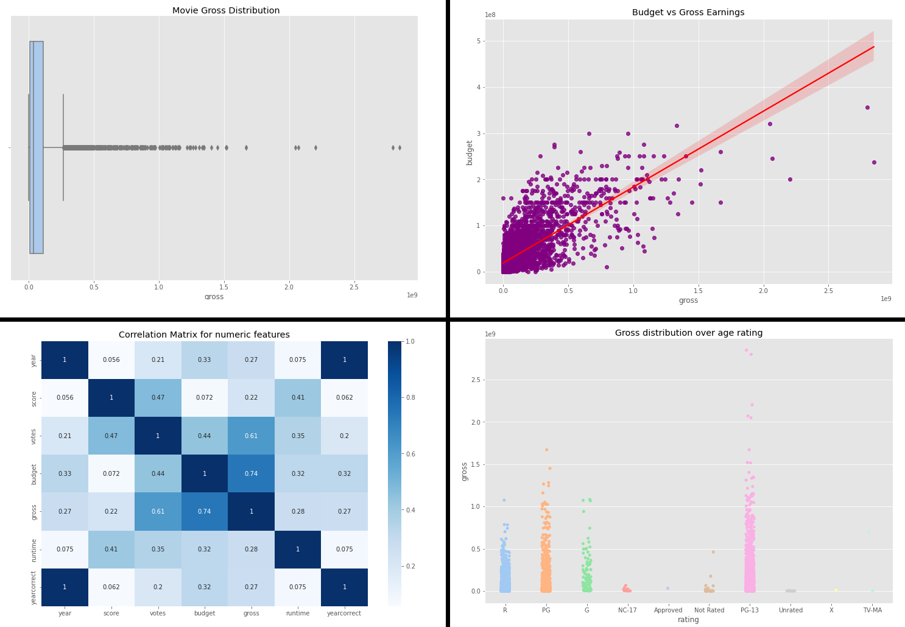

# Jupyter Movie Gross Analysis

Small project using **Jupyter Notebook** to explore data from a movie performance dataset, with focus on what affect gross earning the most.

Python libraries **Pandas**, **NumPy** and **Seaborn** were used to process and visualize the data on a simple and dynamic way.

### Here is a little sneak peek, check the notebook for more detail!

